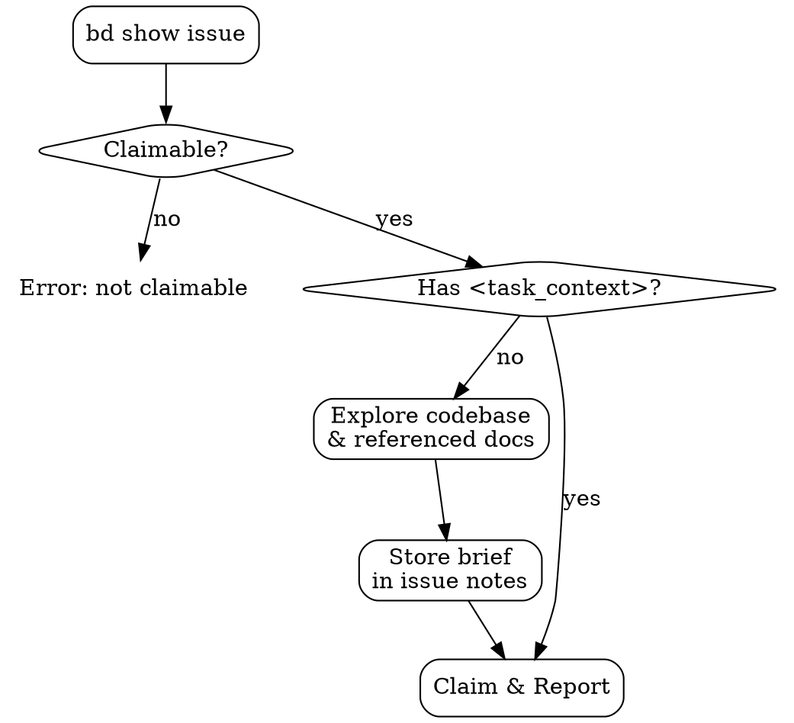

# Gather Context

Gather full context for beads issue `$ARGUMENTS` by exploring the codebase and referenced documents, then store a structured context summary in the issue notes.



---

## Requirements

Run `bd show $ARGUMENTS` and verify the following before proceeding. If any requirement is not met, report the corresponding error (see Common Issues) and stop.

- **Claimable status** — The issue's status must be claimable (e.g., `open`, `backlog`, or `todo`). If the issue is already `in_progress`, `done`, `closed`, or otherwise not claimable, report an error.

---

## Step 1: Check for Existing Context

Inspect the issue's notes (from the `bd show` output above) for an existing `<task_context>` block. If present, go to **Step 4: Claim and Report** and report:

> Context already gathered for issue `$ARGUMENTS`. The task context is available in the issue notes.

Do not re-gather or output the brief.

## Step 2: Explore Context

Read and investigate the codebase directly (you are already running in a forked Explore context):

1. **Referenced documents** — Read any architecture docs, specs, PRDs, or parent issues linked from the issue.
2. **Relevant code areas** — Identify and read the key source files, modules, types, and interfaces that the issue touches or depends on.
3. **Existing patterns and conventions** — Note naming conventions, error handling patterns, test patterns, and project structure conventions observed in the relevant code.
4. **Dependencies** — Identify internal modules and external libraries involved.
5. **Existing tests** — Find and read test files related to the affected code areas to understand current coverage and test style.

## Step 3: Store Context in Issue

Synthesize your findings into a context brief and append it to the issue's notes wrapped in a `<task_context>` tag:

```bash
bd note $ARGUMENTS "<task_context>
- **Issue summary**: What needs to be done and why
- **Affected code areas**: Key files and modules with brief descriptions of their role
- **Relevant types and interfaces**: Important type definitions and contracts
- **Patterns to follow**: Conventions observed in the existing code
- **Dependencies**: Internal and external dependencies involved
- **Test landscape**: Existing test coverage and test style in affected areas
- **Open questions**: Anything unclear or needing user input
</task_context>"
```

Fill in each section with the actual findings — do not use the template text above verbatim.

## Step 4: Claim and Report

```bash
bd update $ARGUMENTS --status=in_progress
```

Report to the caller:

> Context gathered for issue `$ARGUMENTS`. The task context is available in the issue notes.

Do not output the context brief itself — the calling agent should read it from the issue when needed.

---

## Common Issues

- **Issue not claimable** — If the issue status is `in_progress`, `done`, `closed`, or any other non-claimable state, report:

  > Error: Issue `$ARGUMENTS` has status `<status>` and cannot be claimed. Only issues with a claimable status (e.g., `open`, `backlog`, `todo`) can be gathered.

  Do not proceed with context gathering.
