# Implement Fix Workflow

Fix the bug described in beads issue `$ARGUMENTS` by systematically reproducing and investigating the issue, performing root cause analysis, writing regression tests that fail before the fix, implementing the fix, and gating on PR approval.

```mermaid
flowchart TB
  subgraph phase0 ["Phase 0: Prepare"]
    bd_show["bd show issue"]
    claimable{"Claimable?"}
    error["Error: not claimable"]
    gh_link["Verify GH ↔ Beads\nlinked"]

    bd_show --> claimable
    claimable -- "no" --> error
    claimable -- "yes" --> gh_link
  end

  gather["Phase 1\nGather Context\n(Explorer Agent)"]

  subgraph phase2 ["Phase 2: Investigation"]
    invest_setup["Create team, subtasks,\nbranch & worktree"]
    invest_agent["Launch Debugger\nAgent"]
    repro["Reproduce Bug"]
    investigate["Investigate Root Cause\n(logs, code analysis,\nbisection, tracing)"]
    rca["Root Cause Analysis\nRecord in GH + Beads"]
    rca_ok{"Root cause\nidentified?"}
    inconclusive["Summarize research\nin GH + Beads\nNotify user & STOP"]
    plan["Plan of Action\nCreate child bead issues"]

    invest_setup --> invest_agent
    invest_agent --> repro
    repro --> investigate
    investigate --> rca
    rca --> rca_ok
    rca_ok -- "no" --> inconclusive
    rca_ok -- "yes" --> plan
  end

  subgraph phase3 ["Phase 3: Regression TDD"]
    tdd_setup["New branch & worktree"]
    tdd_agents["Launch Tester +\nCoder Agents\n(parallel)"]
    write_tests["Tester: Write Regression\nTests (must FAIL)"]
    verify_fail["Verify Tests Fail\n(proving bug exists)"]
    fix_code["Coder: Implement Fix\n(tests must PASS)"]
    verify_pass["Verify All Tests Pass"]

    tdd_setup --> tdd_agents
    tdd_agents --> write_tests
    write_tests --> verify_fail
    verify_fail --> fix_code
    fix_code --> verify_pass
  end

  code_review["Phase 4: Code Review\n3 Review Agents\n(parallel)"]
  has_fixes{"MUST FIX\nissues?"}
  fix_cycle["Phase 5: Fix Cycle\nDispatch fixes to\nCoder + Tester"]

  fix_pr["Phase 6\nCreate Fix PR"]
  pr_review{"User Reviews\nFix PR"}
  pr_relay["PR Feedback Relay\nAgents read comments,\nfix & reply"]

  resolution["Phase 7: Resolution\nClose subtasks"]
  cleanup["Phase 8: Cleanup\nShut down agents,\ndelete team & worktrees"]

  phase0 --> gather
  gather --> phase2
  inconclusive --> cleanup
  plan --> phase3
  verify_pass --> code_review
  code_review --> has_fixes
  has_fixes -- "yes" --> fix_cycle
  fix_cycle -- "re-review" --> code_review
  has_fixes -- "no" --> fix_pr
  fix_pr --> pr_review
  pr_review -- "comments" --> pr_relay
  pr_relay --> pr_review
  pr_review -- "approved\n& merged" --> resolution
  resolution --> cleanup
```



---

## Phase 0: Prepare

Ensure the bug is tracked in both beads and GitHub and that the two are linked.

1. Run `bd show $ARGUMENTS` and verify:
   - **Claimable status** — The issue's status must be claimable (e.g., `open`, `backlog`, or `todo`). If the issue is already `in_progress`, `done`, `closed`, or otherwise not claimable, report an error (see Common Issues) and stop.
   - **Issue type** — Confirm it is a bug (type `bug`). If it is not a bug, warn the user but proceed if they confirm.

2. **Check for a linked GitHub issue:**
   - Inspect the beads issue description and notes for a GitHub issue URL (e.g., `https://github.com/<owner>/<repo>/issues/<number>` or `#<number>`).
   - If a GitHub issue URL is found, verify it exists: `gh issue view <number>`.
   - If no GitHub issue is linked, search for a matching one: `gh issue list --search "<bug title>"`.
     - If a match is found, link it by updating the beads issue notes: `bd update $ARGUMENTS --notes "GitHub: <url>"`.
     - If no match is found, create one:

       ```bash
       gh issue create --title "<bug title>" --body "Linked to beads issue $ARGUMENTS

       <bug description from beads>"
       ```

       Then link the new GitHub issue URL back to the beads issue notes.

3. **Cross-link:** Ensure the GitHub issue body references the beads issue ID, and the beads issue notes contain the GitHub issue URL. Both systems must reference each other.

---

## Phase 1: Context Gathering

Invoke the `gather-context` skill in a separate Explore agent using the Agent tool:

```
Agent(
  description: "Gather context for $ARGUMENTS",
  prompt: "/gather-context $ARGUMENTS",
  subagent_type: "Explore"
)
```

This runs in a separate Explore agent context and stores a `<task_context>` brief in the beads issue notes.

Confirm the agent reports that context was stored in the issue before proceeding to Phase 2.

---

## Phase 2: Investigation

### Setup

1. Create a team via TeamCreate.

2. Create beads subtasks and link them as children of `$ARGUMENTS`:

   ```bash
   bd create --title="Investigate: Reproduce and diagnose <bug>" --description="Reproduce the bug, investigate root cause, produce RCA" --type=task --priority=1
   bd dep add <investigate-id> $ARGUMENTS --type=parent-child
   ```

3. Create an **investigation branch** and worktree:
   ```bash
   git worktree add /tmp/<bug>-investigate -b <bug>/investigate
   cd /tmp/<bug>-investigate && pnpm install
   ```

### Run Investigation

Invoke the `investigate-bug` skill in a debugger agent using the Agent tool:

```
Agent(
  description: "Investigate bug $ARGUMENTS",
  prompt: "/investigate-bug $ARGUMENTS",
  subagent_type: "metapowers:debugger"
)
```

This runs in a forked debugger agent context. The debugger will reproduce the bug, investigate the root cause, produce a Root Cause Analysis, commit it to `.specs/<bug>/root-cause-analysis.md`, and record findings in both beads issue notes and the linked GitHub issue.

Confirm the agent reports that investigation is complete. Close the investigation beads subtask after the agent completes.

### Evaluate Investigation Outcome

Read the RCA from the beads issue notes (`<root_cause_analysis>` block). Evaluate whether the investigation identified a clear root cause:

**If root cause was identified** → proceed to Plan of Action below.

**If the bug could not be reproduced AND no root cause was identified** → the investigation is inconclusive. Do NOT attempt a fix. Instead:

1. **Summarize the research** — compile a summary of everything the debugger tried, what was ruled out, and what remains unknown.
2. **Record in beads** — update the issue notes with an `<investigation_summary>` block:
   ```bash
   bd update $ARGUMENTS --notes "<investigation_summary>
   ## Investigation Summary (Inconclusive)

   ### What was tried
   <Summary of reproduction attempts and investigation techniques used>

   ### What was ruled out
   <Hypotheses that were tested and disproven>

   ### What remains unknown
   <Open questions and areas that could not be investigated further>

   ### Recommendations
   <Suggestions for how to make progress — e.g., more data needed, specific logs to enable, environment to test in>
   </investigation_summary>"
   ```
3. **Record in GitHub** — post the summary as a comment on the linked GitHub issue:
   ```bash
   gh issue comment <number> --body "## Investigation Summary (Inconclusive)

   <contents of the summary>"
   ```
4. **Notify the user** and **STOP** — do not proceed to Phase 3. Report:

   > Investigation for bug `$ARGUMENTS` was inconclusive — root cause could not be determined. Research findings have been recorded in both beads and GitHub. Review the investigation summary to decide next steps (e.g., gather more data, enable logging, try to reproduce in a different environment).

5. Skip to **Phase 8: Cleanup**.

**If the bug was reproduced but root cause remains unclear** — this is also inconclusive. Follow the same steps above, but note in the summary that the bug was successfully reproduced and include the reproduction steps for future reference.

### Plan of Action

Based on the RCA, create a plan of action and child beads issues:

1. Document the fix plan in `.specs/<bug>/fix-plan.md` covering:
   - What files need to change and how
   - What regression tests need to be written
   - Any related areas that should be checked for the same pattern
   - Order of operations (tests first, then fix)

2. Create child beads issues for each unit of work:

   ```bash
   bd create --title="Regression tests: <specific test description>" --description="Write failing tests that prove the bug exists. Tests MUST fail before the fix." --type=task --priority=1
   bd dep add <test-id> $ARGUMENTS --type=parent-child

   bd create --title="Fix: <specific fix description>" --description="Implement the fix. Regression tests must pass after this." --type=task --priority=1
   bd dep add <fix-id> $ARGUMENTS --type=parent-child
   bd dep add <fix-id> <test-id> --type=blocks
   ```

   Create as many test and fix tasks as needed — one per distinct area or concern identified in the RCA.

---

## Phase 3: Regression TDD

### Setup

1. Shut down the debugger agent (it is no longer needed), clean up the investigation worktree, and create a new **fix branch** from main:

   ```bash
   git worktree remove /tmp/<bug>-investigate
   git pull origin main
   git worktree add /tmp/<bug>-fix -b <bug>/fix
   cd /tmp/<bug>-fix && pnpm install
   ```

2. Copy the RCA and fix plan into the worktree if they were committed to the investigation branch:
   ```bash
   git checkout <bug>/investigate -- .specs/<bug>/
   ```

### Launch Fix Agents

Launch two agents in parallel (`subagent_type: "general-purpose"`, `mode: "bypassPermissions"`, `run_in_background: true`). Both work in the same worktree — coordinate via SendMessage to avoid file conflicts.

**Tester Agent** — writes regression tests FIRST:

The tester's prompt MUST instruct them to:

- Work in `/tmp/<bug>-fix`
- Read the RCA and fix plan first
- Claim their beads regression test task(s)
- **Write regression tests that PROVE the bug exists:**
  - Each test must target a specific aspect of the bug identified in the RCA
  - Tests must be designed to FAIL with the current (buggy) code
  - Tests must be designed to PASS once the fix is correctly applied
  - Cover the exact reproduction case from the RCA
  - Cover related edge cases and boundary conditions identified in the RCA
  - Cover any "related areas" from the Risk Assessment that might have the same pattern
- **Run the tests and verify they FAIL** — this is critical. A regression test that passes before the fix is not testing the right thing. If a test passes, it means either:
  - The test doesn't actually exercise the buggy code path (fix the test)
  - The bug has already been fixed (investigate and confirm)
- Create as many tests as needed to comprehensively cover the bug and its variations
- Commit the failing tests with a message like "test: add failing regression tests for <bug>"
- Notify the coder agent via SendMessage that regression tests are ready and failing
- Close their beads task(s)

**Coder Agent** — implements the fix AFTER tests are ready:

The coder's prompt MUST instruct them to:

- Work in `/tmp/<bug>-fix`
- Read the RCA, fix plan, and the regression tests written by the tester
- Claim their beads fix task(s)
- **Wait for the tester to confirm regression tests are committed and failing** before writing any fix code
- **Verify the tests fail first** — run the test suite and confirm the regression tests fail as expected
- **Implement the fix:**
  - Follow the recommended fix from the RCA
  - Make the minimal change necessary to fix the root cause
  - Do NOT fix symptoms — fix the root cause
  - Avoid unnecessary refactoring or cleanup beyond what's needed for the fix
- **Run the full test suite after the fix:**
  - All regression tests MUST now pass
  - All existing tests MUST still pass (no regressions introduced by the fix)
  - Run `tsc --noEmit` to verify type safety
- Commit the fix with a message like "fix: <description of what was fixed and why>"
- Notify the tester via SendMessage that the fix is committed
- Close their beads task(s)

### Fix Coordination

The tester and coder coordinate via SendMessage:

1. Tester writes regression tests → verifies they fail → notifies coder
2. Coder verifies tests fail → implements fix → runs full suite → notifies tester
3. Tester verifies all tests pass (regression + existing) → confirms fix is complete
4. If tester finds issues, sends feedback to coder → coder iterates
5. Both close their beads tasks when done

---

## Phase 4: Code Review

Launch review agents in parallel for the fix. Use `subagent_type: "feature-dev:code-reviewer"` with `run_in_background: true`.

Group the 7 review areas into 3 focused agents:

### Review Agent 1: Style, Formatting, and Cruft (Areas 1, 5, 6)

**Area 1 — Coding Style:**

- Consistent naming (camelCase for vars/functions, PascalCase for types/interfaces)
- Idiomatic TypeScript (proper types, no unnecessary `any`, good generics use)
- Clean imports (no unused, consistent ordering)
- Function size and decomposition
- Readability

**Area 5 — Debugging Cruft:**

- Remove stray `console.log` not part of intentional output
- Remove commented-out code
- Remove temporary files, scratch code, TODO comments that should be issues
- Check for leftover debugging flags or investigation artifacts

**Area 6 — Consistent Formatting:**

- Indentation, semicolons, quotes, trailing commas, brace style, line length

### Review Agent 2: Efficiency and Error Handling (Areas 2, 4)

**Area 2 — Efficiency and Algorithm Appropriateness:**

- No Rube Goldberg solutions
- Appropriate data structures
- No unnecessary allocations, redundant iterations, or O(n^2) where O(n) is possible
- No shortcuts that sacrifice correctness

**Area 4 — Robust Error Handling:**

- Network failures, malformed input, empty input
- Null/undefined guards
- Consistent error handling pattern
- No unhandled promise rejections
- Edge cases considered

### Review Agent 3: Types/Lint and Test Coverage (Areas 3, 7)

**Area 3 — Error/Warning Cleanup:**

- Run `tsc --noEmit` and report errors
- Run the test suite and report failures — **execute the tests and include the output**
- Check for `@ts-ignore`, `@ts-expect-error`, `as any`

**Area 7 — Regression Test Coverage:**

- Regression tests cover the exact reproduction case from the RCA
- Regression tests cover edge cases and boundary conditions from the RCA
- Regression tests cover related areas identified in the Risk Assessment
- All regression tests fail without the fix and pass with it (verify by examining test logic)
- Existing test suite still passes — no regressions introduced
- BDD-style test descriptions clearly document what bug scenario each test covers
- All tests passing

### Review Output Format

Each reviewer rates issues as:

- **MUST FIX**: Genuinely problematic (not a nitpick)
- **NITPICK**: Minor style preference

Only MUST FIX items are reported (with file:line citations).

**CRITICAL**: Review Agent 3 MUST execute the test suite and include the output. Test failures are MUST FIX items that get sent back to the fix agents.

---

## Phase 5: Fix Cycle

1. **Collate findings** from all reviewers, deduplicating overlapping issues.
2. **Create a beads fix task** with the full list of MUST FIX items.
3. **Dispatch fixes** to the coder and tester agents (re-launch if needed) via SendMessage:
   - Code issues → coder
   - Test issues → tester
   - Both must run full test suite after fixes
4. Wait for fixes to complete.
5. **Run verification review** (round 2) — quick pass to confirm all fixes applied, tests pass, tsc clean. **Execute the tests again.**
6. **Repeat** if verification finds new issues. Stop when reviews are clean and all tests pass.

---

## Phase 6: Fix PR

1. Push the branch: `cd /tmp/<bug>-fix && git push -u origin <branch>`
2. Create a PR with `gh pr create` including:
   - Summary of the bug and root cause
   - Reference to the RCA document, the beads issue, and the GitHub issue
   - What was fixed and why (link to the root cause, not symptoms)
   - Test results (regression test count, full suite pass rate)
   - Review status (rounds completed, all clean)
3. Notify the user the fix PR is ready for review.

**PAUSE HERE.** Wait for user approval. If the user leaves PR comments, use the PR Feedback Relay process below.

### PR Feedback Relay

When the user leaves comments on the fix PR, re-launch the coder and tester agents (if not still running) and instruct each to:

1. **Read the PR comments** — Use `gh pr view <pr-number> --comments` to read all comments on the PR. Understand what the reviewer is asking for.
2. **Address the issues** — Make the appropriate code or test changes based on the feedback. Run the full test suite to ensure nothing is broken. Commit the fixes to the fix branch.
3. **Reply to each comment** — Use `gh pr comment <pr-number> --body "<response>"` to reply on the PR with their resolution. Each agent MUST identify themselves in their reply (e.g., "[Coder Agent] Updated the fix to..." or "[Tester Agent] Added additional regression test for...") so the reviewer knows which agent addressed which feedback.

After both agents have addressed all comments, notify the user that the PR has been updated and is ready for re-review.

---

## Phase 7: Resolution

Once the user approves and merges the PR:

1. Close all remaining beads subtasks.
2. **Do NOT close the parent beads issue** — gate on explicit user approval.

---

## Phase 8: Cleanup

1. Shut down all agents.
2. Delete the team via TeamDelete.
3. Remove any remaining worktrees: `git worktree remove /tmp/<bug>-investigate` and `git worktree remove /tmp/<bug>-fix`
4. Push final beads state to main.
5. Verify: `git status` shows clean, up to date with origin.

---

## Important Rules

- Always use beads (`bd`) for task tracking — never markdown TODOs or TaskCreate
- Always pre-create worktrees manually — don't rely on `isolation: "worktree"`
- Break tasks into beads subtasks BEFORE delegating to agents
- Shut down agents promptly when their work is done
- Fix stale `isActive` flags in team config if TeamDelete fails
- Never close the parent issue without user approval
- **Reproduction is mandatory**: never skip attempting to reproduce the bug
- **No root cause, no fix**: if investigation is inconclusive, summarize research and stop — do not guess at a fix
- **Regression tests must FAIL before the fix** — a passing test before the fix is not a regression test
- **Tests must be executed** during review — not just read, but run
- **Fix the root cause, not the symptom** — the RCA drives the fix
- Bug must be linked in BOTH beads and GitHub before investigation begins
- RCA must be recorded in BOTH beads issue notes and GitHub issue comments
- Coder and tester must collaborate via SendMessage, not work in isolation
- All debugging instrumentation must be cleaned up before the fix phase

---

## Common Issues

- **Issue not claimable** — If the issue status is `in_progress`, `done`, `closed`, or any other non-claimable state, report:

  > Error: Issue `$ARGUMENTS` has status `<status>` and cannot be claimed. Only issues with a claimable status (e.g., `open`, `backlog`, `todo`) can be fixed.

  Do not proceed with the workflow.

- **Root cause not identified** — If the investigation is inconclusive (whether or not the bug was reproduced), do NOT attempt a fix. Summarize the research in beads and GitHub, notify the user, and skip to cleanup. See "Evaluate Investigation Outcome" in Phase 2.

- **No GitHub issue found** — If no matching GitHub issue exists, create one automatically and link it to beads. Do not block on this.

- **Regression test passes before fix** — If a regression test passes on the current (buggy) code, the test is not exercising the buggy code path. The tester MUST investigate and fix the test before proceeding.
