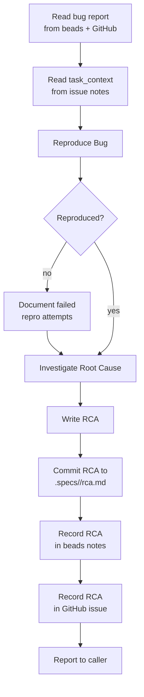

# Investigate Bug

Investigate the bug described in beads issue `$ARGUMENTS` by reproducing it, diagnosing the root cause, and recording findings in both beads and the linked GitHub issue.

You are running as the debugger agent — use your full debugging methodology, techniques, and common-pattern awareness throughout this investigation.



---

## Step 1: Read the Bug

1. Run `bd show $ARGUMENTS` to read the full bug report — title, description, notes, and any linked issues.
2. Extract the linked GitHub issue URL from the beads issue notes. Run `gh issue view <number>` to read the GitHub issue (comments, labels, timeline).
3. Read the `<task_context>` block from the issue notes to understand the affected code areas, relevant types, dependencies, and test landscape.

If any of this information is missing, note the gap and proceed with what's available.

---

## Step 2: Reproduce and Investigate

Apply your debugging methodology to reproduce the bug and identify the root cause. Use whatever techniques and instrumentation the situation calls for.

If the bug **cannot be reproduced** after thorough attempts, proceed with code-analysis-based investigation and flag the non-reproduction in the RCA.

---

## Step 3: Write and Commit the RCA

1. Produce an RCA document following your standard RCA output format.
2. Remove all debugging instrumentation (console.logs, temporary code, scaffolding).
3. Commit the RCA document:
   ```bash
   git add .specs/<bug>/root-cause-analysis.md
   git commit -m "docs: root cause analysis for <bug>"
   ```

---

## Step 4: Record Findings

1. **Record in beads** — Update the beads issue notes with the RCA:
   ```bash
   bd update $ARGUMENTS --notes "<root_cause_analysis>
   <contents of the RCA>
   </root_cause_analysis>"
   ```

2. **Record in GitHub** — Post the RCA as a comment on the linked GitHub issue:
   ```bash
   gh issue comment <number> --body "## Root Cause Analysis

   <contents of the RCA>"
   ```

---

## Step 5: Report

Report to the caller:

> Investigation complete for issue `$ARGUMENTS`. Root cause analysis has been committed to `.specs/<bug>/root-cause-analysis.md` and recorded in both beads and GitHub.

If the bug could not be reproduced, report:

> Investigation complete for issue `$ARGUMENTS` (bug could not be reproduced). Root cause analysis based on code analysis has been committed and recorded. Review the RCA to decide whether to proceed with a fix.

Do not output the full RCA — the calling skill should read it from the issue notes or the committed file.

---

## Common Issues

- **No task_context in issue notes** — If gather-context has not been run, note the gap and investigate using the bug report and code exploration alone. Do not block.

- **No linked GitHub issue** — If the beads issue has no GitHub issue linked, skip the GitHub recording step and note it in the report. The calling skill is responsible for linking.

- **Bug cannot be reproduced** — Do not block. Proceed with code-analysis-based investigation. Flag non-reproduction prominently in the RCA and in the report.
