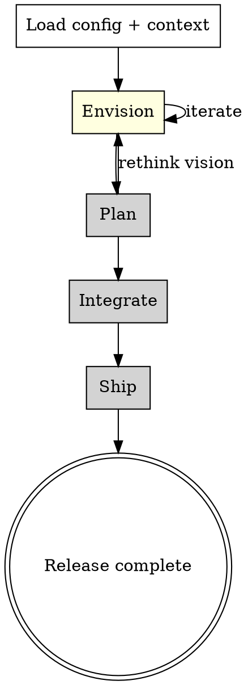

# Release Loop

The release loop is the outermost feedback loop in the development process. It
takes a product vision from narrative (PRFAQ) through planning, integration, and
delivery. Each phase is handled by a **configurable strategy skill** -- this loop
defines the process, not the implementation of each phase.

## Before You Begin

1. **Load configuration.** Read the project's `metapowers.yml` in the project root.
   If it doesn't exist, read the plugin's default config at
   `config/default.yml` (relative to the metapowers plugin root).

2. **Determine or create release context.** Check if there is an active release
   context. If not, ask the user for a release name (a short slug, e.g.,
   `v2-auth-overhaul` or `ai-code-review`). This name is used to resolve path
   templates in the adapter config.

3. **Store the release context.** Create a release state file at the adapter path
   for the release. For the default markdown adapter, this means creating the
   release directory (e.g., `docs/releases/{release_name}/`).

## Phases

Note: grayed-out phases are not yet implemented. The spike covers the Envision
phase to validate the pluggable architecture.

### Phase 1: Envision

**Purpose:** Collaboratively author a PRFAQ that articulates the customer value
narrative for this release.

**Dispatch procedure:**

1. Read the `strategies.release.envision` value from the config.
   It should be a skill name (e.g., `metapowers:prfaq-author`).

2. Before invoking the strategy skill, prepare the context it will need:
   - The release name
   - Any existing PRFAQ content (if iterating on a previous version)
   - The artifact path where the PRFAQ should be stored (resolved from the
     `adapters.prfaq.path_template` config value, with `{release_name}` replaced)

3. Invoke the strategy skill using the Skill tool.

4. After the strategy skill completes, **you return to this loop.** The strategy
   produces the PRFAQ content. You handle storage:

   **Storage (adapter dispatch):**
   - Read the `adapters.prfaq` section from the config.
   - Based on the adapter `type`:
     - `markdown_files`: Write the PRFAQ content to the resolved `path_template`.
       Create parent directories if needed. Commit the file to git.
     - `github_issues`: (future) Create a GitHub Issue with the PRFAQ content.
     - Other adapters: follow the adapter reference in `references/adapters/`.

5. Inform the user that the Envision phase is complete and show them where the
   PRFAQ was stored.

### Phase 2: Plan (not yet implemented)

**Purpose:** Decompose the PRFAQ vision into epics, user stories, and tasks.

When this phase is reached, inform the user:
> "The Plan phase strategy is not yet configured. To implement it, create a
> strategy skill and add it to `metapowers.yml` under `strategies.release.plan`."

### Phase 3: Integrate (not yet implemented)

**Purpose:** Assemble completed features and validate against the PRFAQ narrative.

(Same stub message as Plan.)

### Phase 4: Ship (not yet implemented)

**Purpose:** Release preparation, deployment, and stabilization.

(Same stub message as Plan.)

## Config-Driven Dispatch Pattern

This is the core pattern that makes metapowers a framework rather than a recipe.
At every phase boundary, you:

1. **Read the config** to find the strategy skill name
2. **Prepare context** (release name, input artifacts, output path)
3. **Invoke the strategy** via the Skill tool
4. **Handle the output** via the configured adapter
5. **Advance to the next phase** or loop back

The loop skill (this file) owns the PROCESS. Strategy skills own the WORK.
Adapter config owns the STORAGE. These three concerns are independent.

## Interface Contract: What Strategy Skills Must Do

A strategy skill invoked by this loop MUST:

1. **Collaborate with the user** to produce the phase's primary artifact.
2. **Signal completion** clearly (e.g., "The PRFAQ is ready for review" or
   "The design document is complete").
3. **NOT decide what phase comes next.** The loop handles transitions.
4. **NOT store artifacts.** The loop handles storage via the adapter config.
   The strategy should hold the completed content for the loop to store.

A strategy skill MAY:
1. Ask the user clarifying questions.
2. Propose alternatives and get approval.
3. Iterate on the artifact collaboratively.
4. Read existing artifacts (via paths the loop provides).
